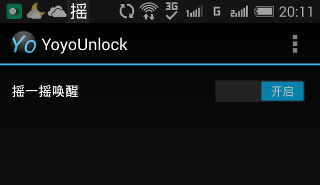
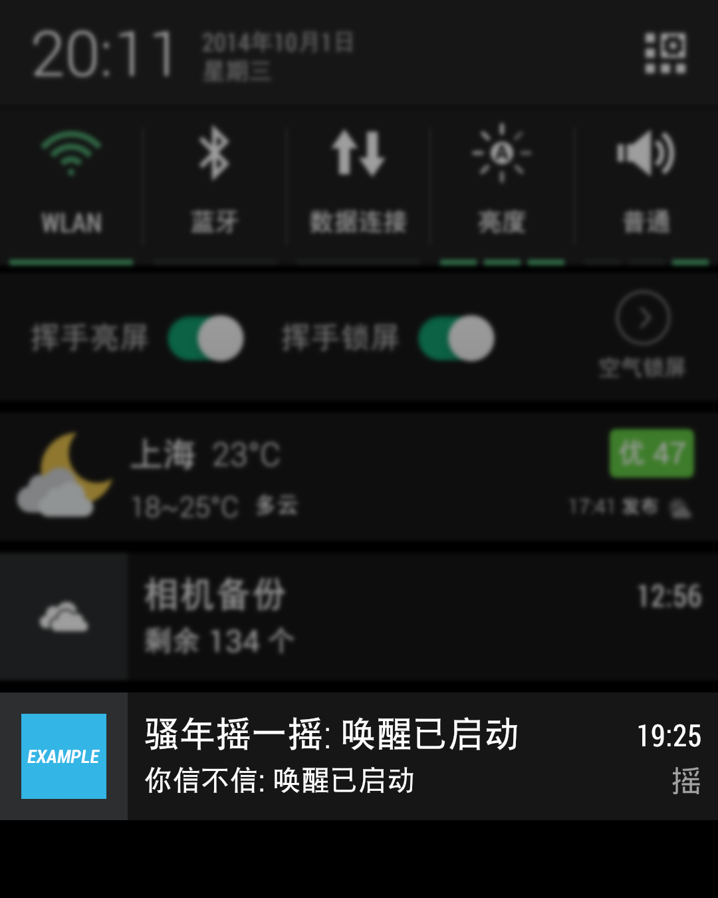
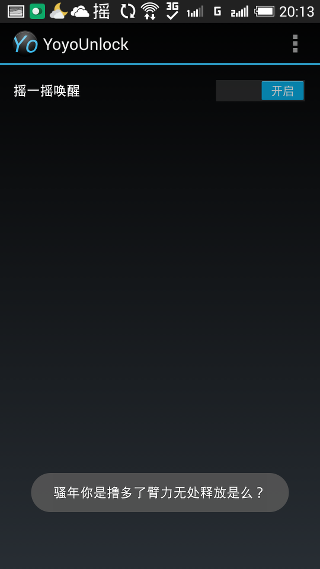

摇一摇唤醒
==========

概览
-------

之前一直在用空气锁屏，感觉还是很不错地，但很容易误操作。
我想如果能有一个摇晃一下手机就能让它唤醒的软件就好了，可是在网上搜了大半天没有找到如意的，于是就有了这个软件。

使用方法
-------------

启动程序后激活【摇一摇唤醒】开关即可。
【摇一摇唤醒】开关激活后，在通知栏中可以看到摇一摇唤醒的通知栏。
此时即可开始摇手机了。

* <s>如果手机解锁时摇一摇，则进入自动锁定状态。</s>（这个功能还没写）你自己摇摇看会发生什么？

* 如果手机锁定时摇一摇则自动唤醒。如果遇到无法唤醒的情况，<s>请激活【锁屏后强制激活】，但可能会增加耗电量。</s>（这个也是，作者比较懒，还没写）就按电源键暂时凑合着用吧。

还碰到一个比较妖孽的情况。由于我手机上安装了动动计步器，测试摇一摇唤醒的时候突然发现，只要摇一摇动动计步器计就开始计数了……嗯，于是在家里坐着写了一天程序，竟然也摇了相当于300多步的运动量。

改进了摇晃探测的算法，按以下方法更容易摇醒：

>    按手机X轴或Y轴连续摇动4次以上（包括），重力感应幅度大于14米/秒²或在设置中设置的【摇晃探测阈值】。

手机轴的识别方法如下：

下载
-------

2014-10-03 Release v0.2 [下载](https://github.com/dewafer/yoyoUnlock/releases) 

更新说明
--------

2014-10-03 v0.2
* 增加了菜单中的【设置】选项
* 增加了【设置】选项中的【自启动】选项
* 增加了【设置】选项中的【使用自动以...】及【摇晃探测阈值】选项
* 增加了【调试工具】中的【列出所以感应器】和【摇晃测试】
* 修正了摇晃探测的算法，摇醒变得更容易了

